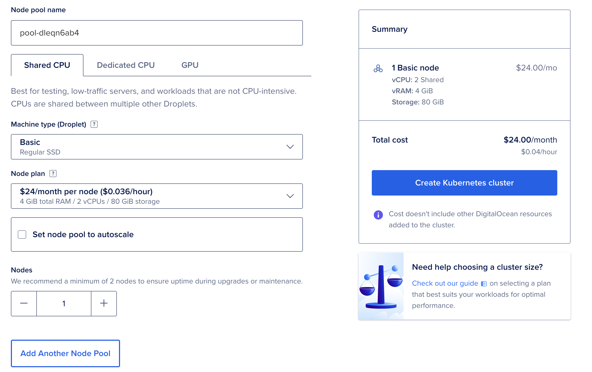
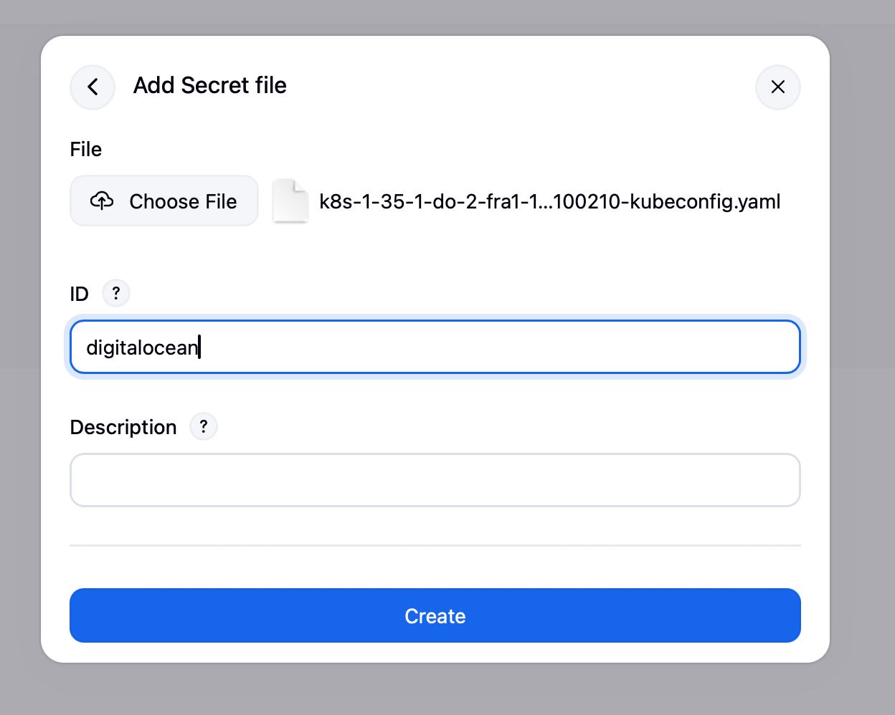
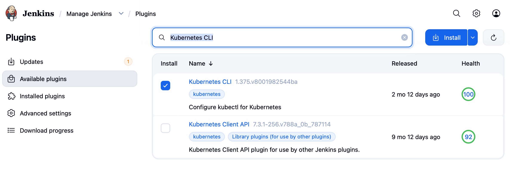
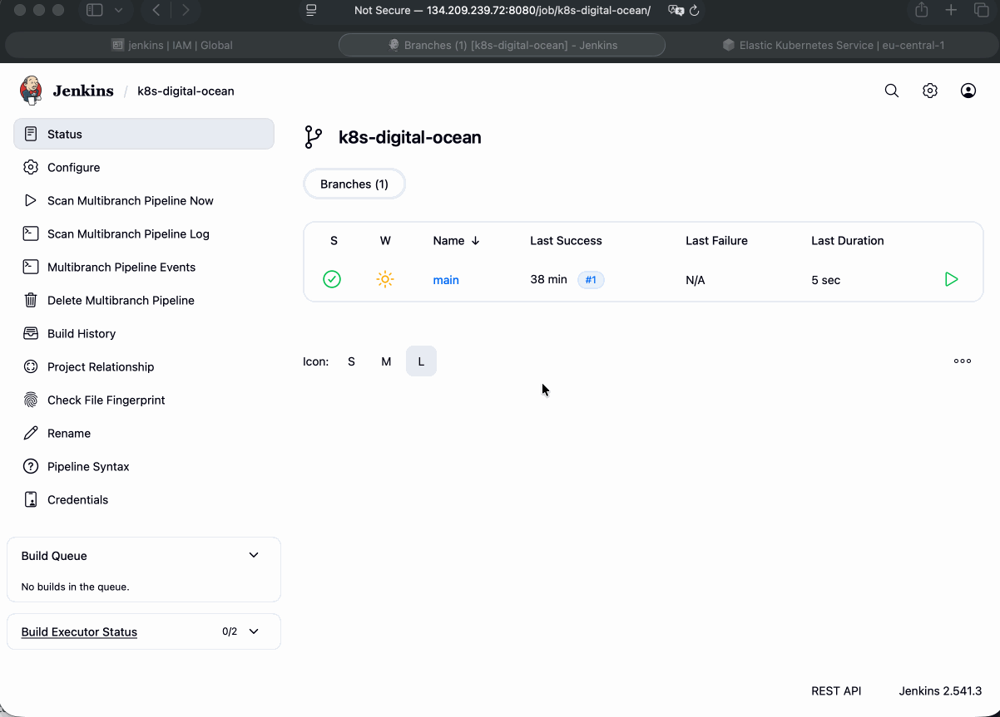

# Module 11 - Kubernetes on AWS - EKS

This repository contains a demo project created as part of my **DevOps studies** in the [TechWorld with Nana – DevOps Bootcamp](https://www.techworld-with-nana.com/devops-bootcamp).

**Demo Project:** CD - Deploy to DigitalOcean Kubernetes cluster from Jenkins Pipeline

**Technologies used:** Kubernetes, Jenkins, DigitalOcean Kubernetes, Docker, Linux

**Project Description:**

- Create K8s cluster on DigitalOcean
- Install `kubectl` as Jenkins Plugin
- Adjust `Jenkinsfile` to use Plugin and deploy to DigitalOcean Kubernetes cluster

---

### 1. Create a K8s Cluster on DigitalOcean

1. Create a minimal Kubernetes cluster with **1 node** in the DigitalOcean console.

   

2. Download the kubeconfig file and set it as your active context:

   ```sh
   export KUBECONFIG=k8s-kubeconfig.yaml
   ```

### 2. Configure a Multibranch Pipeline in Jenkins

1. Go to **Dashboard** → **New Item**.
2. Name it `k8s-digital-ocean`, select **Multibranch Pipeline**, and click **OK**.

3. Under **Branch Sources**, click **Add source** → **GitHub** and fill in:

   | Field                | Value                                                |
   |----------------------|------------------------------------------------------|
   | Credentials          | `github`                                             |
   | Repository HTTPS URL | `https://github.com/explicit-logic/eks-module-11.5`  |

   Click **Validate** to confirm access.

4. Under **Behaviors**, click **Add** and enable:
   - `Discover branches`

5. Under **Build Configuration**, set:
   - Script Path: `Jenkinsfile`

6. Click **Save** — Jenkins will scan the repository and create a job for each branch.

#### Store Credentials in Jenkins

1. Navigate to `k8s-digital-ocean` → **Credentials** → **Global** → **Add Credentials**.
2. Select **Secret file** as the credential type.
3. Upload the kubeconfig file of your DigitalOcean K8s cluster.
4. Set the **ID** to `digitalocean`.

   

### 3. Install the Kubernetes CLI Jenkins Plugin

1. Navigate to **Manage Jenkins** → **Plugins** → **Available plugins**.
2. Search for `Kubernetes CLI` and install it.

   

3. Restart Jenkins to complete the installation.

   > **Note:** SSH into the Jenkins server and start the Jenkins container again if running in Docker.

### 4. Configure the `Jenkinsfile` to Deploy to the K8s Cluster

1. Retrieve the `serverUrl` from your kubeconfig file: `clusters` → `cluster` → `server`.

2. Add the following deploy stage to your `Jenkinsfile`:

   ```groovy
   stage('deploy') {
       steps {
           script {
               echo "deploying docker image..."
               withKubeConfig([credentialsId: 'digitalocean', serverUrl: params.SERVER_URL]) {
                   sh 'kubectl create deployment nginx-deployment --image=nginx'
               }
           }
       }
   }
   ```

### Demo


